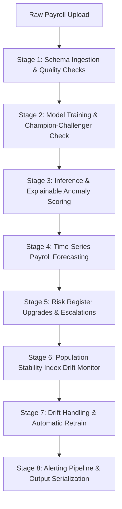

# AI-Powered Payroll Intelligence & Anomaly Detection System

An enterprise-ready, production-grade automated payroll analytics and risk monitoring system. The platform digests monthly payroll reports, identifies financial/operational anomalies using machine learning, forecasts future payroll budgets, monitors data drift, and provides explainable audit trails via a secure FastAPI server and an interactive Streamlit dashboard.

---

## 🛠 Tech Stack

- **Backend Logic**: Python 3.12+, Pandas, NumPy, Scikit-Learn (Isolation Forest, Random Forest)
- **API Engine**: FastAPI, Uvicorn, Starlette TestClient, Pydantic
- **Dashboard Interface**: Streamlit, Plotly (Interactive Charting)
- **Quality & Tests**: Pytest, joblib

---

## 📐 System Architecture & 8-Stage Pipeline

The application operates as an orchestrated sequential pipeline:



### Pipeline Overview
1. **Schema & Features (`p1_feature.py`)**: Maps variable schema column headers, runs missing data checks, and engineers features (e.g. `attendance_ratio`, `salary_diff`).
2. **Model Training (`p2_training.py`)**: Trains an Isolation Forest for anomalies and a Random Forest classifier for absenteeism. Evaluates challenger models against champion models using a $5\%$ F1-score improvement threshold.
3. **Inference & Explanations (`p3_inference.py`)**: Computes multi-dimensional anomaly scores and auto-generates natural language risk explanations.
4. **Forecasting (`p4_forecasting.py`)**: Projects future payroll expenditures using triple exponential smoothing.
5. **Risk Register (`p5_risk.py`)**: Tracks multi-run risk history, logs risk score trends (UP/DOWN/STABLE), and triggers escalation levels.
6. **Drift Monitoring (`p6_drift_monitor.py`)**: Calculates Population Stability Index (PSI) values for features to detect input shifts.
7. **Drift Handling (`p7_drift_handle.py`)**: Triggers automatic model retraining or alert escalations when significant drift (PSI > 0.25) occurs.
8. **Alerting & Summary (`p8_alerting.py`)**: Gathers pipeline status, deduplicates alerts, and serializes CSV/JSON run reports.

---

## 📁 Repository Structure

```
payroll_system/
├── api/
│   └── main.py                 # FastAPI Endpoint Routers & PII Masking
├── config/
│   ├── settings.py             # Directory Paths, Seeds, and Secret Key configuration
│   └── column_mapping.json     # Standardized Schema Synonym Maps
├── models/
│   ├── registry.py             # Model Registration, Versioning, and Promotion
│   └── registry_manager.py     # Production Rollbacks & Registry History
├── pipelines/
│   ├── p1_feature.py           # Feature Pipeline & Ingestion Validation
│   ├── p2_training.py          # Challenger-Champion Model Trainers
│   ├── p3_inference.py         # Inference Engine & Text Explanations
│   ├── p4_forecasting.py       # Time-Series Forecasting
│   ├── p5_risk.py              # Risk Register Managers
│   ├── p6_drift_monitor.py     # PSI Data Drift Monitor
│   ├── p7_drift_handle.py      # Retrain Triggers & Calibrations
│   ├── p8_alerting.py          # Alert Deduplication & Final Report Exporters
│   └── pipeline_runner.py      # Orchestrates Steps 1 through 8 Sequentially
├── store/                      # Directory Cache for parquet, register, and models
├── tests/
│   ├── phase1/ to phase4/      # Unit Test Suites
│   └── phase5/
│       └── test_integration.py # FastAPI Starlette Integration Tests
└── streamlit_app.py            # Streamlit Dashboard App
```

---

## 🚀 Getting Started

### Prerequisites
- Python 3.12 or 3.13 installed.

### 1. Installation
Clone this repository and set up a virtual environment inside the `payroll_system` folder:
```bash
# Navigate to the project root directory
cd "AI-Powered Payroll anomaly detection/payroll_system"

# Create a virtual environment
python -m venv .venv

# Activate the virtual environment
# On Windows:
.venv\Scripts\activate
# On macOS/Linux:
source .venv/bin/activate

# Install all project dependencies
pip install -r requirements.txt
```

### 2. Running Automated Tests
Run the entire Pytest test suite across all 5 phases to verify setup correctness:
```bash
python -m pytest tests/ -v
```

### 3. Launching the FastAPI Server
Start the REST API using Uvicorn:
```bash
uvicorn api.main:app --host 127.0.0.1 --port 8000 --reload
```
Access the interactive OpenAPI Swagger documentation at: `http://127.0.0.1:8000/docs`.

### 4. Running the Streamlit Dashboard
Launch the interactive visual dashboard:
```bash
streamlit run streamlit_app.py
```
View the app locally at: `http://localhost:8501`.

---

## 🔒 API Specifications & Security

All mutating and sensitive endpoints require the `X-API-Key` HTTP Header with the value: `super_secret_payroll_key_123`.

### Key Endpoints
- `POST /data/ingest`: Accepts a payroll CSV/Excel file, runs the 8-stage pipeline, and returns the execution run summary. Implements file hash idempotency.
- `GET /runs/{run_id}`: Fetches status step progress log data.
- `GET /employees/high-risk`: Lists all HIGH/CRITICAL employees in the latest run. Supporting PII masking via `?mask_pii=true`.
- `GET /monitoring/drift`: Returns PSI data drift reports.
- `POST /models/rollback`: Rolls back the active production model to the previous champion.
- `GET /health`: Health diagnostic indicators for storage backends.

---

## ☁️ Production Deployment

### Streamlit Community Cloud
1. Commit all files to your GitHub Repository:
   ```bash
   git add .
   git commit -m "Configure production release"
   git push origin main
   ```
2. Log in to [Streamlit Share](https://share.streamlit.io/).
3. Click **"New app"**, select your repository, branch `main`, and set the Main file path to: `payroll_system/streamlit_app.py`.
4. Click **"Deploy!"**.

### FastAPI Containerized Deployment
For Docker deployments, use the following `Dockerfile` outline:
```dockerfile
FROM python:3.12-slim
WORKDIR /app
COPY requirements.txt .
RUN pip install --no-cache-dir -r requirements.txt
COPY . .
EXPOSE 8000
CMD ["uvicorn", "api.main:app", "--host", "0.0.0.0", "--port", "8000"]
```

---

## 👥 Author

Developed and maintained by [Codigoaprendiza02](https://github.com/Codigoaprendiza02).

